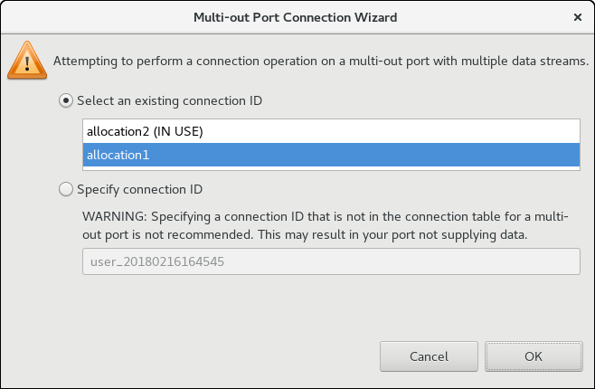

A multi-out port allows a component to select specific streams to be sent over specific connections out of arbitrarily-selected ports. To use multi-out ports, a component must include the following property:

```xml
<structsequence id="connectionTable">
  <struct id="connectionTable::connection_descriptor" name="connection_descriptor">
    <simple id="connectionTable::connection_id" name="connection_id" type="string"/>
    <simple id="connectionTable::stream_id" name="stream_id" type="string"/>
    <simple id="connectionTable::port_name" name="port_name" type="string"/>
  </struct>
  <configurationkind kindtype="property"/>
</structsequence>
```

To steer a particular stream out of a particular connection through a particular port, an element must be added to the connection table structure that identifies the stream ID/connection ID/port name set. After this element is added to the structure, any data pushed to a particular port is filtered by that port in the appropriate fashion.

A port does not filter its output until an element in the connection table sequence mentions the port name. If a port is listed on the connection table, then data is pushed out only if both the stream ID and connection ID match.

{}
The multi-out capability is supported only for BulkIO and BurstIO output (uses) ports.
{}

### Multi-out Port Support in the IDE

When interacting with FrontEnd devices, it is easiest to perform an operation (for example, Plot Port Data) directly on the desired tuner. For more information, refer to [Plotting a Tuned Receiver]().

Otherwise, the REDHAWK IDE provides support for the following operations using multi-out ports:

  - Creating connections to downstream devices or components
  - Plotting
  - Tracking SRI data
  - Data List feature
  - Snapshot feature
  - Play port feature

When performing an operation on a multi-out port, if there is only one connection ID, it is used by the IDE. If there are multiple connection IDs in the connection table, the IDE displays the Multi-out Port Connection Wizard dialog with the option to either select a connection ID from the entries in the connection table or input one manually.

##### Mult-out Port Connection Wizard

