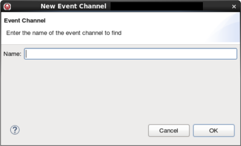

Producers and consumers can be connected either point-to-point or through an Event Channel in the IDE. Connecting a producer directly to a consumer does not require an application and can be done in the Sandbox:

```py
from ossie.utils import sb
sb.catalog()
#['structs_test', 'm_in', 'prop_changes', 'm_out','pass']
prod=sb.launch("m_out")
cons=sb.launch("m_in")
prod.connect(cons)
#True
sb.start()
```
#### Output:
```py
foo 0 hello
foo 1 hello
foo 2 hello
foo 3 hello
foo 4 hello
foo 5 hello
foo 6 hello
```

Connecting producers to consumers through an Event Channel requires an application. An application can also support point-to-point connections.

Below is a description of how to connect producers through point-to-point and through an Event Channel:

1.  Add producer and consumer components.
2.  For point-to-point messaging, connect the output `MessageEvent` port, `message_out` in this example, to the input `MessageEvent` port of the receive component.
3.  For messaging via an Event Channel, add an Event Channel to the waveform and connect to it.

    1.  In the waveform Diagram, under **Palette > Find By:**
          - Select **EventChannel** and drag it onto the diagram. The **New Event Channel** dialog is displayed.
            ##### New Event Channel
            
          - Enter the Event Channel you want to find and click **OK**. The **EventChannel** is displayed in the diagram.
    2.  Connect the Uses (Output) `MessageEvent` port of the sending component, `message_out` in this example, to the Event Channel.
    3.  Connect the Uses (Output) `MessageEvent` port of the receiving component, `message_in`, to the Event Channel. This is the **black** Output port that must be connected to the Event Channel.

In this example, connections are made point-to-point and through the Event Channel. Therefore, for every message sent, two messages are received.
