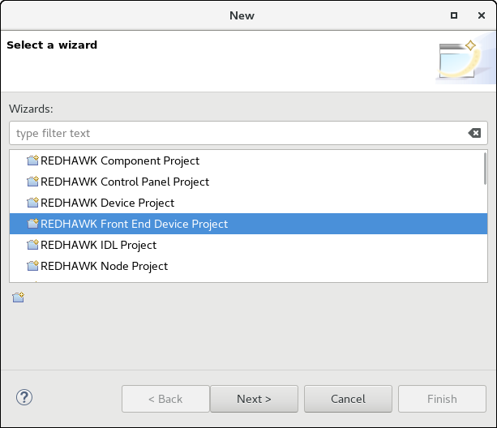
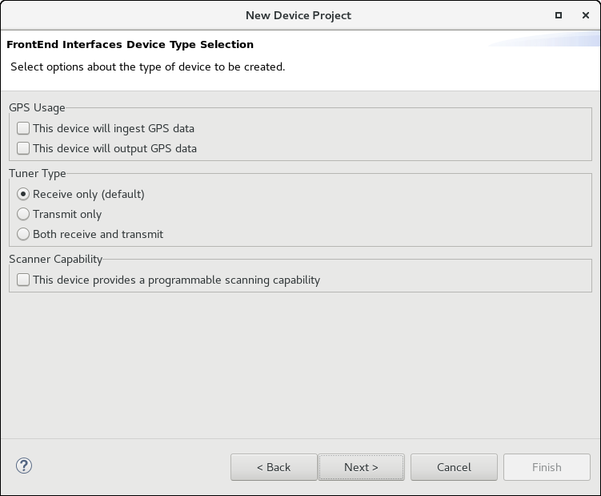
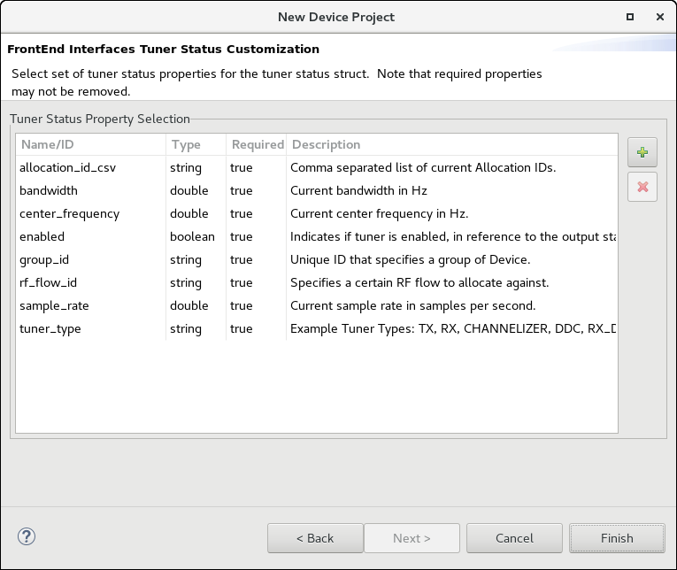
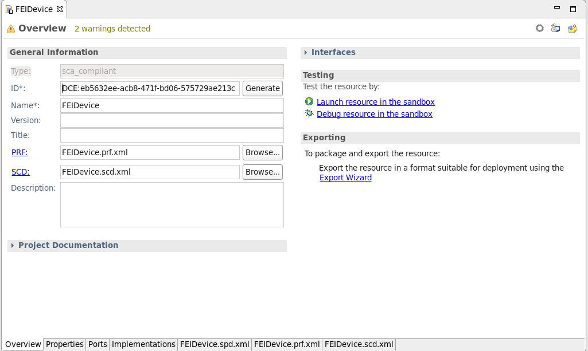
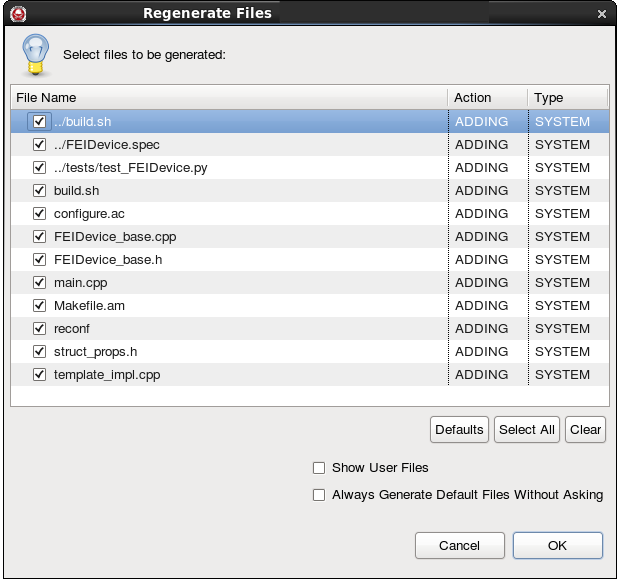
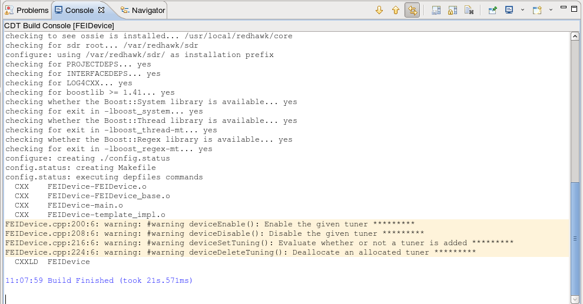

#### Using the FEI Wizard to Create an FEI Device

The **REDHAWK Front End Device Project** wizard enables users to quickly create an FEI compliant receiver or transmitter device. In the wizard, the user specifies the physical properties of the device, including whether the device ingests or outputs GPS and if the device has digital or analog input and output ports. Additionally, the user can choose to augment the required tuner status properties with additional optional properties.

1.  To open the wizard and create a new device, select **File > New > Other**.

    The **Select a wizard** page is displayed:

    ##### Select a Wizard
    
2.  Select **REDHAWK Front End Device Project** and click **Next**.

    The **Create a REDHAWK Device Project** page is displayed:

    ##### Create a REDHAWK Device Project
    
3.  In the **Project name** field, enter a project name and click **Next**.

    The **New Implementation** page is displayed:

    ##### New Implementation
    
4.  Select the programming language; enter a description for this implementation; and click **Next**.

    The **Setup Code Generation** page is displayed:
    ##### Setup Code Generation
    
5.  Click **Next**.

    The **FrontEnd Interfaces Device Type Selection** page is displayed:

    ##### FrontEnd Interfaces Device Type Selection
    
6.  Select the appropriate aspects of the device (needs GPS data or produces GPS data) and its general usage (receive/transmit, scanning capability). Click **Next**.

    The **FrontEnd Interface Tuner Options** page is displayed:

    ##### FrontEnd Interface Tuner Options
    
7.  Specify the types of inputs and outputs that the device supports (analog, digital float) and click **Next**.

    The **FrontEnd Interfaces Tuner Status Customization** page is displayed:

    ##### FrontEnd Interfaces Tuner Status Customization
    

      - To add an optional tuner status properties, click **+**, select the checkboxes for the properties, and click **OK**.
      - To remove optional tuner status properties, under **Tuner Status Property Selection**, select the properties to remove, and click **X**. If a required property is selected, the **X** button is disabled.
      - Click **Finish** to exit this wizard.

Upon exiting this wizard,the FEI device project to is created, and the Overview tab of the project is displayed:

##### FEI Device Overview tab


#### Editing a FrontEnd Interfaces Device Project

After completing the wizard, you can add ports, properties, and descriptions to an FEI device using the same processes used for all other components and devices. For more information about adding ports, refer to [SoftPkg Editor Overview Tab](). For more information about adding properties, refer to [SoftPkg Editor Properties Tab]()

For example, it may be useful to add a property used to uniquely identify the target device, such as an IP address.

{}
When editing a FrontEnd Device Project:

  - Do not rename properties that were generated using the wizard.
  - Do not modify the pre-populated values generated in the wizard (for example, the property, `device_kind`). You may, however, add default values to the properties without pre-populated values, such as `device_model`.
  - Do not change pre-defined FEI Tuner Status properties that were generated in the wizard. You may, however, add user-defined FEI Tuner Status properties.
  - Before adding user-defined FEI Tuner Status properties, check to see if relevant pre-defined FEI Tuner Status properties are already available. Use pre-defined FEI Tuner Status properties whenever possible.
{}

To add or remove optional FEI Tuner Status properties using the **FrontEnd Interfaces Tuner Status Customization** dialog, on the Overview tab of the project, click the **Edit FrontEnd properties** icon. The same dialog used to define the FEI device’s tuner status property on the creation wizard () is displayed. Add or remove the properties and click **Finish**.

#### Generating and Customizing the Source Code

1.  On the **Overview** tab for the project, click the **Generate All Implementations** icon to generate the source code.

    The **Regenerate Files** dialog is displayed:

    ##### Regenerate Files
    

2.  Select the files to be generated and click **OK**.

    Files are generated that define the classes for the FEI device. In C++, the FEI base class inherits from the `frontend::FrontendTunerDevice` class  (or `frontend::FrontendScanningTunerDevice` for a scanner) to provide much of the FEI capability. The generated FEI device class must be modified to interact with the target device. During generation, intentional compiler warnings are inserted in the main class to indicate where code should be modified to reflect the behavior of the device. The output of the make command for a C++ device, including the compiler warnings, is displayed in the Console view:

    ##### FEI Device Compiler Warnings
    

    There are five functions that contain a default implementation that should be modified to match the desired behavior. These functions are `constructor`, `deviceEnable`, `deviceDisable`, ` deviceSetTuning`, and `deviceDeleteTuning`. The `constructor` function is called when the device is instantiated. During allocation of an FEI device, `deviceSetTuning` is called and, if successful, `deviceEnable` is called. During deallocation, `deviceDisable` is called followed by a call to `deviceDeleteTuning`.

    For scanners, the additional methods `deviceSetTuningScan`, `setScanStrategy`, `setScanStartTime`, `getScanStatus` must be modified to provide the scanner capability.

3.  Add source code to allocate and setup a tuner channel.

    The following table explains what is expected in each function/method.

    {}
Each of the following functions have `fts` and `tuner_id` passed in as parameters. The `tuner_id` parameter specifies which tuner channel to operate on, and `fts` is a reference to the [FEI tuner status]() associated with the specified tuner channel. Additionally, ` deviceSetTuning` has a parameter called `request`, which defines the parameters of the tuning request.
{}

    ##### Functions/methods in the generated code
    | **Function/Method**  | **Description**  |
    | :------------------- | :---------------------- |
    | `constructor`        | This is the REDHAWK constructor. All properties are initialized prior to this function being invoked. The default behavior when implementing a tuner is to create 1 RX_DIGITIZER channel.|
    | `deviceEnable`       | Command the hardware to enable the output and begin generating data. The FEI tuner status element `fts.enabled` is updated to reflect the current state of the tuner output. This is a good place to call `start` to start the service function. |
    | `deviceDisable`      | Command the hardware to disable the output and stop generating data. The FEI tuner status element `fts.enabled` is updated to reflect the current state of the tuner output. This is a good place to call `stop` to start the service function. |
    | `deviceSetTuning`    | Validate that the request parameters can be satisfied by the tuner indicated by `tuner_id`. There are several helper functions (`validateRequest`, `validateRequestVsSRI`, `validateRequestVsRFInfo`, and `validateRequestVsDevice`) provided in the inherited `FrontendTunerDevice` class of the device to assist in validation. Then, either configure the hardware with the tuner request, throw a `BadParameterException` if the request is outside of the capabilities of the tuner, or return false. Update the appropriate FEI tuner status elements (i.e. `fts.center_frequency`, `fts.bandwidth`, `fts.sample_rate`) with the actual values queried from the hardware rather than with the requested values. Push new SRI within this function. Finally, when using the multi-out capability for BulkIO ports, it is recommended that the `matchAllocationIdToStreamId` function be called at this point with the stream ID and Allocation id. Return `True` upon successful configuration of the tuner according to the request, or `False` otherwise. |
    | `deviceDeleteTuning` | Prior to `deallocateCapacity` return, a `pushPacket` call with eos set to `True` must be called, and `deviceDeleteTuning` is where this should occur. Also, update the appropriate FEI tuner status elements (i.e `fts.center_frequency`, `fts.bandwidth`, `fts.sample_rate`) if desired. Return `True` upon success, or `False` otherwise.|

    ##### Additional functions/methods in the generated scanner code
    | **Function/Method**   | **Description**  |
    | :-------------------- | :---------------------- |
    | `deviceSetTuningScan` | Called instead of `deviceSetTuning` when a scanner allocation is made. |
    | `setScanStrategy`     | Called by the user to provide a plan for how the frequencies the scanner will cover. Validate the request and store the plan. |
    | `setScanStartTime`    | Called by the user to specify when a scan should start. At the specified time, the scanner should begin outputting data according to the scan plan. |
    | `getScanStatus`       | Provide the status of all current and scheduled scans |

    In addition to the code required for allocation and deallocation, information used to identify the target device at run-time must be added to the main class. The recommended method for dynamically identifying a target device is through configuration of a property. For example, configuring a property with an IP address or some other unique identifier allows the FEI device to identify the specific target device.
4.  Add source code to interact with the target hardware.

    There are two key aspects to an FEI device: 1) how many channels does it support? and 2) how does it interact with the hardware?

    In an FEI device, the number of channels is set through the `setNumChannels` function. By default, this function is included in the generated code with 1 channel. Interaction with the hardware is, obviously, specific to the hardware. The nature of the hardware (i.e.: receiver, transmitter), is specified for the supported channels as the second argument in the `setNumChannels` function. The valid strings for this argument are: RX_DIGITIZER, TX, RX, CHANNELIZER, DDC, RX_DIGITIZER_CHANNELIZER. See [Types of Tuners]() for more information. By default, `setNumChannels` is populated with RX_DIGITIZER, irrespective of the selections made on the FEI wizard.

    The other aspect of the interaction with hardware is the interaction with the actual driver code. While this interaction is hardware-specific, there are some structures that may be useful. The loop function (`serviceFunction` in C++ and Java, `process` in Python), is iteratively called after the device is started. As part of the `deviceEnable` callback, calling `start` on the device starts processing loop. Conversely, as part of the `deviceDisable` callback, calling the `stop` on the device stops the processing loop.

    {}
The tuner interface provides the ability to set parameters like center frequency and bandwith for the receiver. Any FEI compliant device may not output any data until the transients from any receiver setting change have settled to steady state. In short, all data output from an FEI compliant device must correspond to unambiguous receiver settings.
    {}

    In the service loop function, the implementation of, in the case of a receiver, reading data from the hardware and pushing it out a port would exist. Conversely, in the case of the transmitter, the service loop function would be used to retrieve data from a port and push it through the driver to the hardware.

5.  Add source code to implement FEI-related port functions.

    {}
If using an `RFInfo` port, it may be useful to store the `RFInfo` packet as part of the device because it is not stored within the port.
    {}

#### Installing the FEI Device

To install the FEI device, build the project and export it to the Target SDR. After the FEI device is installed, you can use it in a REDHAWK system.

#### Test-running a Sample FEI Device

Create a new FEI project following the steps shown in [Using the FEI Wizard to Create an FEI Device](#using-the-fei-wizard-to-create-an-fei-device). For the purposes of this example, select Python as the language for the device and `dataShort` as the type for the digital output, otherwise select the defaults on the Wizard for all other settings. Follow steps 1 and 2 in [Generating and Customizing the Source Code](#generating-and-customizing-the-source-code).

In the `deviceEnable` function, add the following line:

```py
self.start()
```

In the `deviceDisable` function, add the following line:

```py
self.stop()
```

In the `process` function, add the following lines:

```py
data = range(10000)
self.port_dataShort_out.pushPacket(data, bulkio.timestamp.now(), False, "my stream id")
```

[Install](#installing-the-fei-device) and [launch]() the device.

To test-run the device, follow these steps:

1.  In the **REDHAWK Explorer** tab, expand the **Sandbox** item.

2.  In the **Sandbox** item, expand the **Device Manager** item. The devices running in the Sandbox are displayed.

3.  Right-click the device’s output Port (probably called `dataShort_out`) and select **Plot Port Data**.
4.  Right-click the running device and and select **Allocate**. The Tuner Allocation dialog is displayed.
##### Tuner Allocation

5.  Enter any arbitrary number in the **Center Frequency**, **Bandwidth**, and **Sample Rate** fields.
6.  To have the wizard perform the allocation as a background job, check the Run in background checkbox. If this checkbox is not checked, the wizard does not close until the allocation is complete.

7.  Click **Finish**. Data is plotted on the plot.

8.  To stop the flow, right-click the device under the **Device Manager** item and select **Deallocate All**. A deallocation warning message is displayed.

9.  Click **Yes** to confirm that you want to deallocate all.
