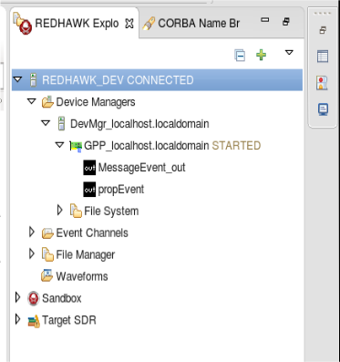
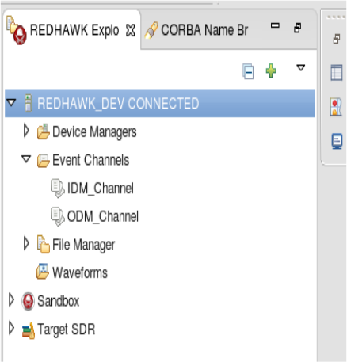
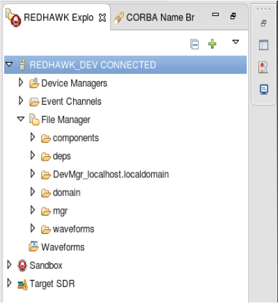
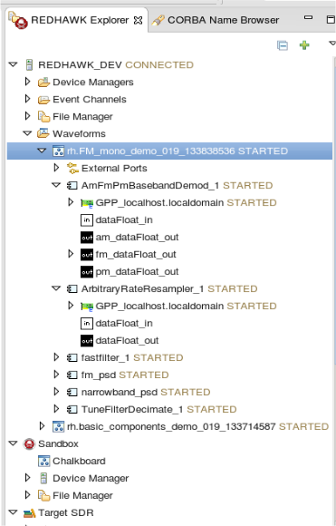

After the domain connection is established, the file system visible to the Domain Manager and its attached Device Managers is displayed in the REDHAWK Explorer View. Detailed information about each item is available in the Properties View.

The Domain Manager’s root contains the following folders:

  - **Device Managers**: Displays the currently connected Device Managers. More than one Device Manager may be connected to the domain. Each Device Manager entry consists of a single node, and each node may contain multiple devices. Right-click devices to monitor port information, plot port output, and play audio.

    ##### Device Managers
    

  - **Event Channels**: Displays the Event Channels in the domain. Right-click a channel to display the **Refresh** and **Listen to Event Channel** options. Select **Listen to Event Channel** to open the **Event Viewer View**.

    ##### Event Channels
    

  - **File Manager**: Displays the file systems in the domain’s view. It contains references to all components, devices, waveforms, and the device and Domain Managers configuration and executable files.

    ##### Example Domain File System
    

  - **Waveforms**: Displays the applications running on the domain. When applications launch, they are displayed and can be expanded to show each of the running components within the application. These components can be expanded to show the device on which they are executing and port information.

    ##### Waveforms
    
