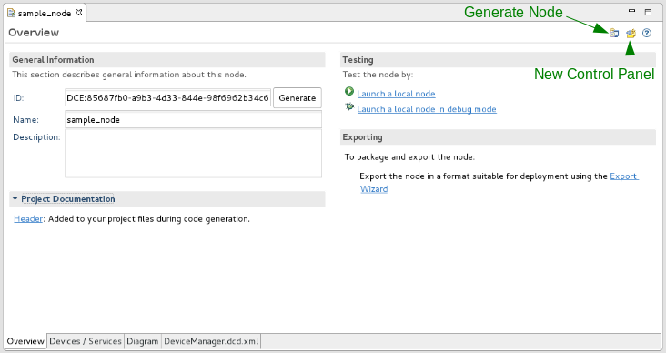
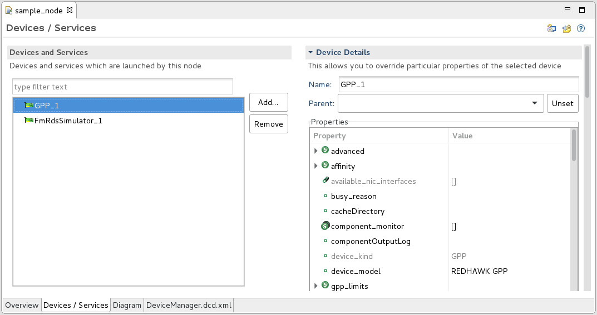
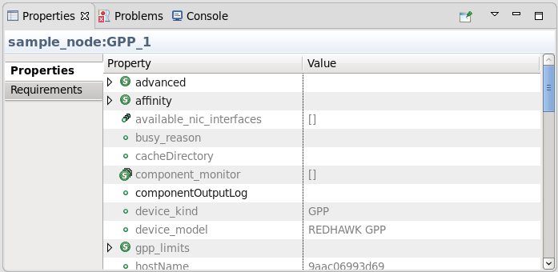
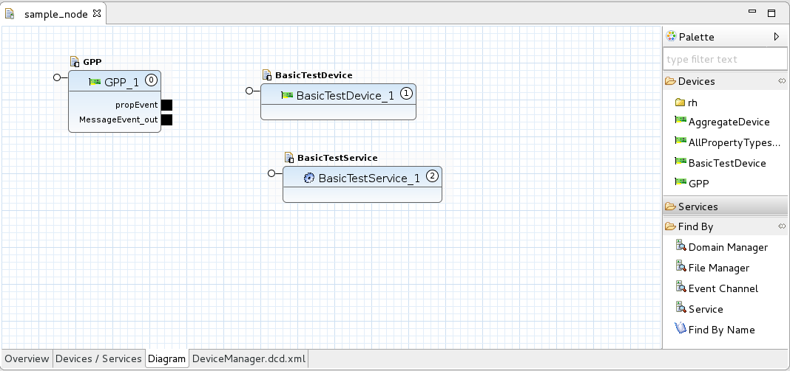

To open the Node Editor, double-click a DCD file from the Project Explorer View. It presents all the content that can be found within the `dcd.xml` file in an editing environment designed for ease of use. The **Node Editor** contains an **Overview**, **Devices / Services**, **Diagram**, and a raw XML tab, which contains the DCD file content.

### Overview Tab
##### Node Editor Overview Tab

The **Overview** tab provides general information about the node, and hyperlinks to additional node-related sections within the IDE. In the top-right corner, the **Generate Node** button is used to generate supporting files for the node. To produce an RPM spec file for the node, click the button.

  - The **General Information** section provides controls to set the **ID**, **Name**, and **Description** of the node.
  - The **Project Documentation** section displays a Header hyperlink, which if clicked, provides the option to create and edit the file "HEADER" in the project. When code generation is performed, the header is applied to your project files.
  - The **Testing** section is currently under development and is presently not supported.
  - The **Exporting** section provides a hyperlink to the **Export Wizard**, which steps through the process of deploying the node into the SDR root.

### Devices/Services Tab
##### Node Editor Devices/Services Tab

The **Devices/Services** tab enables a user to add devices and services from the SDR Root into the node and to configure the properties for the devices and services. When a property is set or changed here, it is specific to this node and does not impact other nodes or instances of this device or service.

The following steps explain how to add a device to the node:

1.  Click **Add…**.

2.  Select the device or service to add.

3.  Click **Finish**.

Use the table in the **Details** section to configure the properties of the device or service.

### Diagram Tab
##### Node Editor Diagram Tab

The **Diagram** section (along with the **Properties View**) provides the same features as the **Devices/Services** tab.

{}
To zoom in and out on the diagram, press and hold `Ctrl` then scroll up or down. Alternatively, press and hold `Ctrl` then press `+` or `-`.
{}

#### Adding a Device and Editing Device Properties in a Node

The following steps explain how to add a device to the node and configure its properties:

1.  Drag the device from the **Palette** onto the diagram.

2.  Select the device.

3.  Open the **Properties View** and verify the Properties tab is selected.
    ##### Properties View
    

4.  From the **Properties View**, change the desired properties.

5.  Press `Ctrl+S` to save the changes.

{}
If you want to quickly find a device in the **Palette**, you can replace the text `type filter text` in the text field at the top of the **Palette** with a keyword to filter the device list.
{}

Like the **Devices/Services** tab, any property modified from the **Diagram** section is specific to this node and does not impact the device’s execution in other environments.

#### Editing the `deployerrequires` Set in a Node

The [`deployerrequires`]() set for a Node is managed through the Requirements tab of the Properties view. When these Requirements are set, they become specific to the node and are written to the `*.dcd.xml` file.

The following steps explain how to edit the `deployerrequires` set.

1.  On the Diagram tab of the Node, select the Device
2.  In the Properties View, verify the Requirements tab is selected.
    ##### Properties View Requirements
    
3.  To add an ID and value, click + and add the ID and value. The ID and value can be any alphanumeric string value. This assigns a `devicerequires` key/value pair to the Node.
4.  To remove an ID and value, select the ID and click X.

#### Using the Find By Feature

From the **Diagram** tab, a user may also use the [**Find By** feature](). The **Find By** feature enables a user to find a resource by name, a service by name or type, or an Event Channel by name.

#### Making Connections

Connections may be made from input to output ports by clicking and dragging from one port to the other. ports may have more than one connection drawn to or from them. Any unsupported or erroneous connection detected by the IDE is marked with an appropriate indicator. Hovering over the indicator provides information concerning the error.

#### Start Order

Each of the Devices/Services within the node contains a number with a circle around it, which represents that device’s/service’s start order. The start order represents the order in which its `start()` method is called by the Device Manager on startup and the `stop()` method is called by the Device Manager on shutdown. The start order ’0’ is called first. Start order is optional and may be changed by right-clicking a Device/Service and selecting **Move Start Order Earlier** or **Move Start Order Later** from the context menu. Devices/Services without a start order will not be started or stopped automatically.

#### The `dcd.xml` tab
The `dcd.xml` tab displays the raw XML data, which describes the node fully. Although not recommended, manually editing the XML file is supported.
