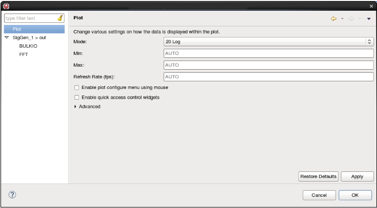
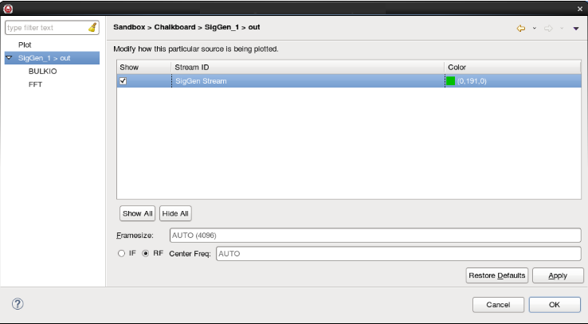
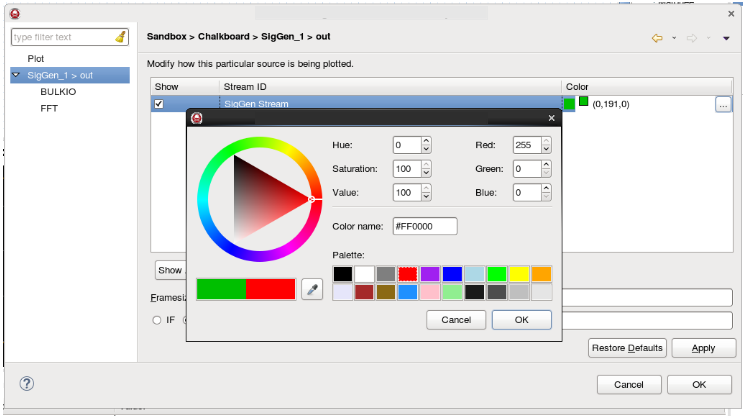
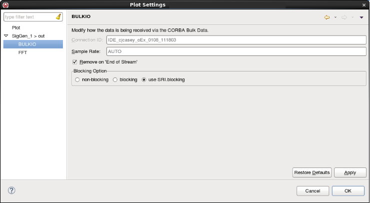
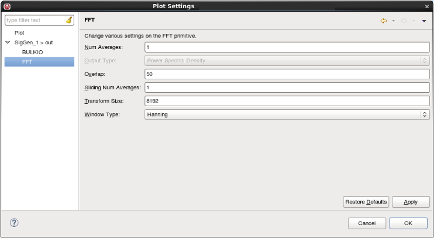

The **Plot Settings** dialog enables the user to adjust certain plot settings.

##### Plot Settings

### Plot

Selecting Plot in the left-hand navigation pane displays the **Plot** section. The **Plot** section enables you to change various settings on how the data is displayed within the plot.

  - **Mode**: Select the Mode of the plot.
  - **Min**: Set the minimum value for the plot. The default value is to automatically determine the minimum.
  - **Max**: Set the maximum value for the plot. The default value is to automatically determine the maximum.
  - **Refresh Rate (fps)**: Set the desired refresh rate in frames per second (fps) to perform smart thinning of the data. Enter 0 to disable smart thinning. The default value is 30 fps.
  - **Enable plot configure menu using mouse**: This checkbox enables the NeXtMidas plot configure menu using the mouse.
  - **Enable quick access control widgets**: This checkbox enables the quick access control widgets to change plot settings from the View. When enabled, Plot Port FFT has a quick control widget for adjusting the FFT number of averages directly in the View.

### Output Port Name

Selecting the Output Port Name in the left-hand navigation pane displays the Output Port Settings dialog:
##### Output Port Settings

The Output Port Settings enable you to modify how the source is being displayed.

  - The **Show** checkbox enables you to turn the plotting of individual data streams on and off.
  - The **Stream ID** displays the Stream ID for each data stream in the plot.
  - Clicking on **Color** brings up the color palette window, which enables you to select a color for the specified stream on the plot.
    ##### Color Palette
    
  - **Framesize**: Enables you to override the displayed default frame size.
  - The **IF** and **RF** radio buttons enable you to toggle between IF and RF frequency values for the x-axis on FFT plots.
  - **Center Freq**: Enables you to override the center frequency value for RF plots. This field is grayed out for IF plots.

Expanding the Output Port Name in the left-hand navigation pane makes the BULKIO and FFT settings available.

### BULKIO

Selecting BULKIO in the left-hand navigation pane displays the **BULKIO** settings dialog:
##### BULKIO Settings

The **BULKIO** settings dialog enables you to modify how the data is received via the CORBA Bulk Data.

  - **Connection ID**: Displays the Connection ID of the current connection.
  - **Sample Rate**: Enables you to set a custom sample rate to override the value in StreamSRI. Enter 0, or leave on AUTO, to use the value from StreamSRI.
  - **Remove on ‘End of Stream’**: This checkbox enables you to select whether the stream is removed from the plot when an eos is received for the selected Stream ID.
  - **Blocking Option**: This enables you to select a blocking option for `pushPacket` when the plot is not able to keep up with the data stream by selecting one of the radio buttons.
      - **non-blocking** - Do not block incoming data.
      - **blocking** - Block incoming data.
      - **use SRI.blocking** (default) - Set the blocking based on the `StreamSRI.blocking` field received from the `pushSRI()` call.

### FFT

Selecting FFT in the left-hand navigation pane displays the **FFT** settings dialog:
##### FFT Settings

The **FFT** section enables you to change various settings on the FFT primitive.

  - **Num Averages**: Enables you to change the number of averages in the FFT.
  - **Overlap**: Enables you to change the overlap of the FFT.
  - **Sliding Num Averages**: Enables you to change the sliding number averages of the FFT.
  - **Transform Size**: Enables you to change the transform size of the FFT. For best results the entry should be a power of 2.
  - **Window Type**: Enables you to change the window type of the FFT.
