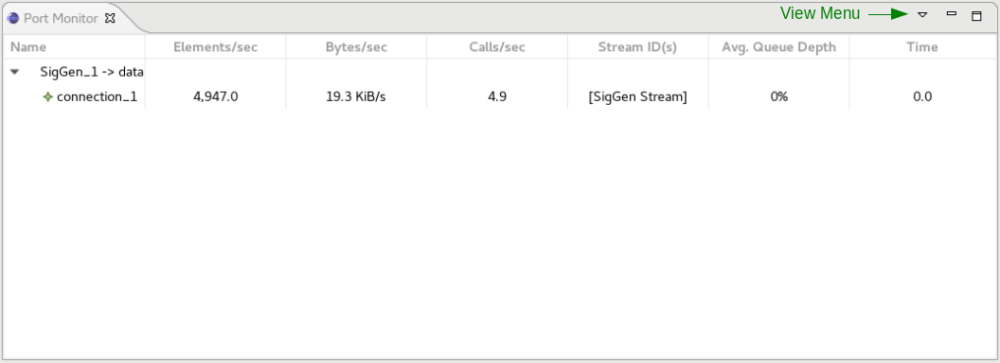

The **Port Monitor** view enables you to monitor the amount of data flowing out of or in to a particular port. These [link statistics]() are helpful when debugging and can help identify which component is slowing down or dropping information during data processing.

To open the **Port Monitor** view, right-click the port of a started component and select **Monitor Ports** from the context menu:

##### Port Context Menu

The **Port Monitor** view is opened:

##### Port Monitor View with Monitor Ports Selected

The View displays the following information:

  - **Name**: The name of the port or port connection.
  - **Elements/sec**: The rate of CORBA elements transferred in the pushPacket data call.
  - **mbps**: Mega Bytes transferred per second.
  - **calls/sec**: Number of push calls per second to the port.
  - **Stream ids**: List of all active stream ids.
  - **Avg. Queue Depth**: For components that queue data before processing/sending, the average queue depth measured as a percentage. If a port does not queue data, this value is set to zero.
  - **Time**: The elapsed time, in seconds, since the last packet was transferred via a push packet call.

The following actions are available in the **Port Monitor** view.

1.  To Configure the **Port Monitor** view:

      - Click the **View Menu**.
      - Select **Configure**.

    The Port Monitor Configuration dialog box is displayed.

    ##### Port Monitor Configuration Dialog
    

    The following options can be configured:

      - **Refresh Interval (sec)**: The time interval between fetching the port statistics.
      - **Column Configuration**: Specifies which columns are visible.

2.  To force a refresh of any connection or port:

      - Right-click the item.
      - Select **Refresh**.

3.  To stop monitoring:

      - Right-click the item.
      - Select **Stop Monitoring**.
