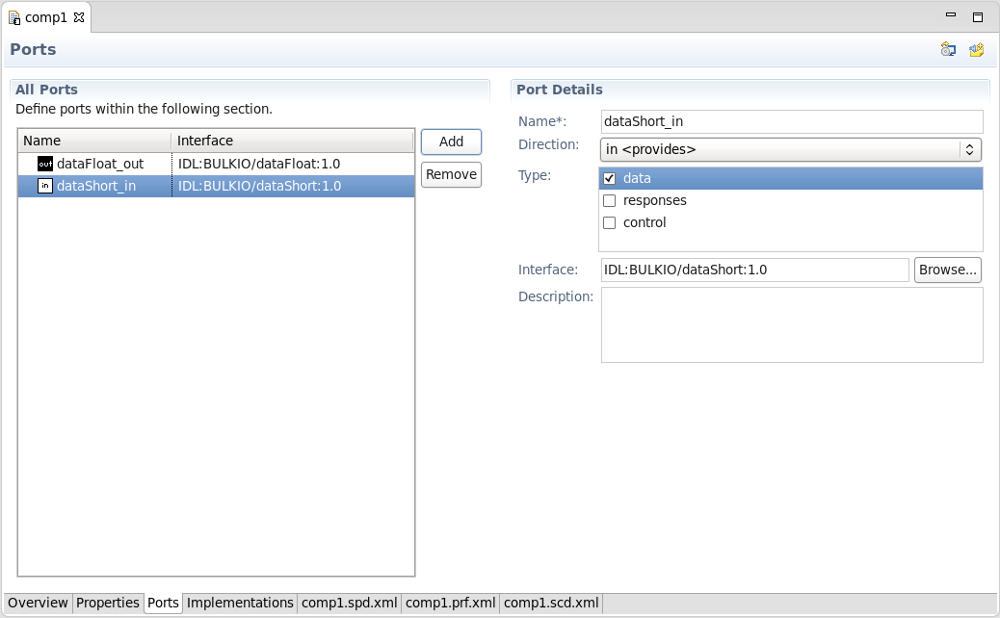
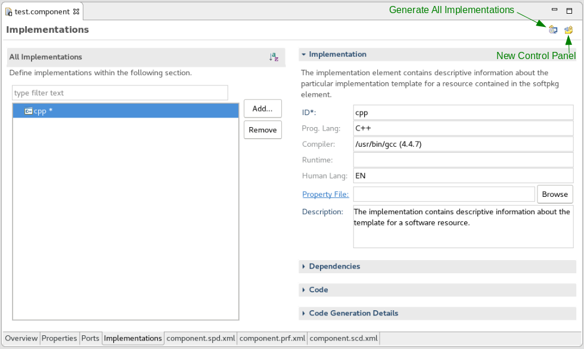

To open the SoftPkg Editor, double-click an SPD file from the Project Explorer View. It presents all the content that can be found within the `spd.xml` file in an editing environment designed for ease of use. If the SPD file references a PRF or SCD file, additional tabs are made available that represent these files in similar fashion.

Each of the editor tabs, with the exception of the raw XML tabs, have the following buttons located in the top right corner:

  - **Generate All Implementations** Button: This button is used to generate the code implementation of the SPD file. The generated code is based on the code generator template that was chosen during the **New Project Wizard** and the content found within the SPD, PRF, and SCD files.
    {}
The code generators are not exhaustive. There are edge case port types that may not compile.
    {}
  - **New Control Panel** Button: This button is used to generate a new control panel.

The SoftPkg Editor is organized into four main tabs:

  - Basic information about the SoftPkg can be edited from the **Overview** tab
  - Properties and messages can be edited from the **Properties** tab
  - Ports can be edited from the **Ports** tab
  - Implementations and code generation settings can be edited from the **Implementations** tab.

The following sections describe each of these tabs.

### Overview Tab

The **Overview** tab is a representation of the content found within the SPD file and contains five sections:

1.  The **General Information** section provides the ability to view and set (if write permissions are granted) the resource’s **ID** and **Name** as well as the location of the PRF and SCD files. The initial content of these fields is auto-generated when the project is created and is generally left unaltered. The optional fields, **Version**, **Title**, and **Description**, may be set to aid in the project’s documentation.
2.  The **Interfaces** section lists the IDLs that this resource inherits. This includes IDLs used by the resource’s ports, lifecycle, and properties. This table is *read only*, and additional IDL interfaces cannot be added here.
3. The Component Content section displays hyperlinks to navigate to the Properties and Implementations tabs of the SoftPkg Editor.
4.  The **Testing** section displays two hyperlinks. **Launch a local component** launches a local instantiation of this resource within the Sandbox. **Launch a local component in debug mode** provides additional runtime control, including the ability to place breakpoints, pause execution, and inspect and modify variables. See [Debugging REDHAWK Components and Devices with Eclipse]() for more information.
5.  The **Exporting** section provides a hyperlink for deploying a project to the SDR Root.
    Use the following procedure to export a project using the **Export Wizard**:

      1. Click **Export Wizard**.
      2. Select the projects to export.
      3. Type or browse to the export location.
      4. Click **Finish**.

### Properties Tab
##### SoftPkg Editor Properties Tab

Within the **Properties** tab, the **All Properties** section displays all of the [properties]() defined for the component or device.

To add a property, click on one of **Add Simple**, **Add Sequence**, **Add Struct** or **Add StructSeq** to create a new property of the corresponding type. To remove a property, select it in the **All Properties** section and click the **Remove** button on the right.
In addition to creating a new property from scratch, a user may also copy an existing property from a deployed resource:

1.  In the **All Properties** Section, click **Browse…**.
2.  Expand **Target SDR**.
3.  Drill down to and select the desired property.
4.  Click **Finish**.

When a property is selected in the **All Properties** section, a type-specific details section appears on the right-hand side of the tab. All property types include a few common fields:

  - **ID** is required, and must be unique within the component or device.
  - **Name** is optional, but if given, is favored over the **ID** for generated code.
  - **Kind** describes the intended use of the property. The default is `property`.
  - **Mode** determines whether the property can be read and/or written. The default is `readwrite`.
  - **Description** is optional; it documents the intended use of the property. User interfaces may present the description as help text.

Nested properties—fields in a struct, or the struct definition for a struct sequence—do not include **Kind** or **Mode**. The parent property determines these fields.

The **Simple Property** details section includes additional fields:

  - **Type** describes the basic data type of the property (e.g., `float`). For complex numeric types, select `complex` in the the combo box next to the type.
  - **Value** is the initial value for the property. If not given, the initial value is undefined.
  - **Units** is strictly informative, but may be displayed in user interfaces.
  - **Enumerations** is a mapping of human-readable string labels to values. User interfaces may use the enumerations to present the labels in place of values.
  - **Action** is only applicable to properties with a kind of `allocation`.
  - **Range**, if enabled, sets optional lower and upper limits on the value. The range is not enforced by generated code; however, user interfaces may choose to enforce it.

Ordinarily, properties are set to their initial value via a call to the component or device’s `initializeProperties()` method. However, for certain use cases, simple properties may receive their initial value on the executable command line by enabling the **Pass on command line** checkbox, located next to **Kind**.

In the **Simple Sequence** details section, the fields **Type**, **Units**, **Action** and **Range** are identical to those for simple properties. The default value of a simple sequence property can be viewed or edited via the **Values** list.

The fields that make up a struct property are displayed as children of the struct in the **All Properties** section.

  - To add a field, right-click the `struct` in the **All Properties** section, select **New** and then select one of **Simple** or **Simple Sequence**.
  - To remove a field, select the field in the **All Properties** section and click **Remove**.

The default value of a struct property is the determined by the default values of its fields.

{}
If any field has a default value, all fields must have a default value.
{}

The default value of a struct sequence may be viewed or edited via the **StructValue** section in the **Struct Sequence Property** details section.

The struct definition appears as a child of the struct sequence in the **All Properties** section. It may be modified in the same manner as a struct property.

### Ports Tab
##### SoftPkg Editor Ports Tab

The **Ports** tab provides the ability to add, edit, and view [port]() information.

Click **Add** to create a new port with default values. The **Port Details** section shows the new port, which can be modified as needed:

  - Give the port a **Name** unique to this component or device.
  - Select a **Direction**: either input, output, or bidirectional.

  {}
Only [Message Consumer]() ports should be bidirectional.
  {}

  - The **Type** is optional and strictly informative. A port may have one or more type, defaulting to control if none is selected.
  - Select the IDL **Interface** that this port implements. Click **Browse…** to open the selection dialog.
  {}
By default, the interface selection dialog only shows the most common interfaces used in REDHAWK. Select the **Show all interfaces** checkbox to show the complete list for IDL interfaces within the Core Framework’s install location.
{}
  - Optionally, enter a **Description** of the port, such as its intended use.

An existing port may be edited by selecting it from the **All Ports** section and changing its options via the **Port Details** section.

To remove a port, select it from the **All Ports** section and click the **Remove** button.

### Implementations Tab

The **Implementations Tab** is a representation of the content found within the SCD file. It describes the programming language implementations that are generated and the hardware dependencies required for this resource.

During the **New Project Wizard**, the initial programming language and code generation template were selected. In the **All Implementations** section there is the option to add additional programming language implementations.

The right portion of the editor is context sensitive, and displays the information pertaining to the selected implementation.

  - The **Implementation** section defines the compiler for the selected language and provides a custom description for this implementation.
  - The **Dependencies** section provides the opportunity to place limitations on a resource so that it may only execute on a suitable device. This is done through the use of property dependencies. A resource’s execution may be limited to a particular device by placing a dependency on a device’s property. To provide compatibility among different sets of users, well known properties have been created, including different OS and processor types. The OS and processor dependencies sections contain a preset list of properties to select from.
  - The **Code** section indicates the local file name, priority, and executable for the implementation.
  - The **Code Generation Details** section contains configuration values for the implementation’s code generation. This includes the code template used, output folder location and code generator properties.
