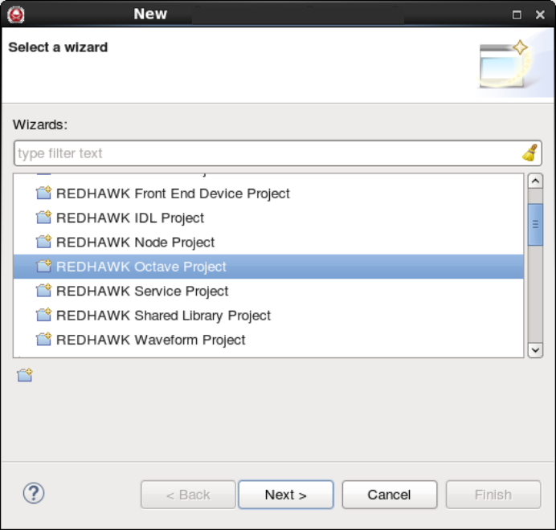
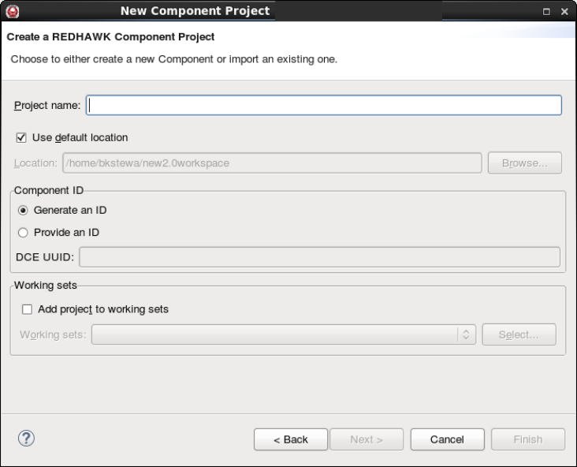
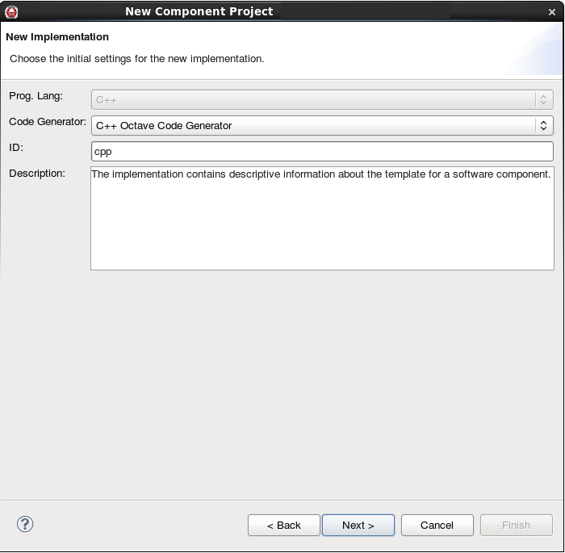
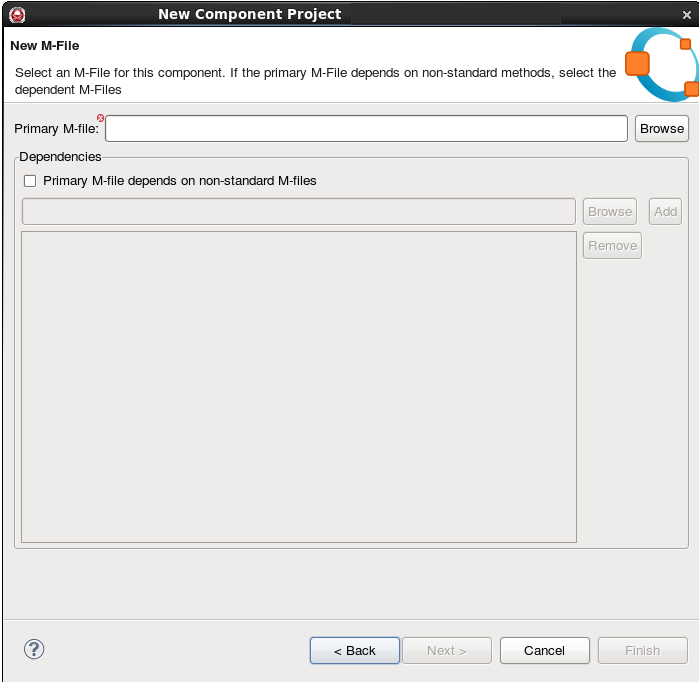
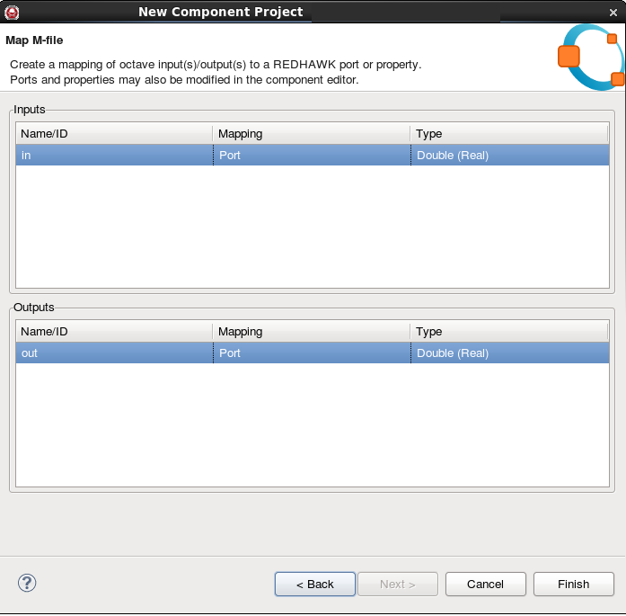

The **Octave Wizard** enables users to import existing Octave M-files for easy conversion into REDHAWK C++ components. The user imports an existing M-file, as well as any required dependent M-files, and then maps the M-file’s inputs and outputs to REDHAWK ports and properties. The following procedure explains how to use the **Octave Wizard**.

1.  To open the **Octave Wizard**, select **File > New > Other**.

    The **Select a wizard** page is displayed:
    ##### Select a Wizard Dialog
    

2.  Select **REDHAWK Octave Project** and click **Next**.

    The **Create a REDHAWK Component Project** page is displayed:
    ##### Create a REDHAWK Component Project Page
    

3.  In the **Project name** field, enter a project name and click **Next**.

    The **New Implementation** page is displayed:
    ##### New Implementation Page
    

4.  Enter an ID and a description for this component implementation and click **Next**.

    The **New M-File** page is displayed:
    ##### New M-File Page
    

5.  In the **Primary M-file** field, enter the location of the Octave M-file you want to import or click **Browse** and navigate to the file. If the primary M-file depends on non-standard methods, select **Primary M-file depends on non-standard M-files** and select the dependent M-files. Click **Next**.

    The **Map M-file** page is displayed:
    ##### Map M-file Page
    

6.  The **Map M-file** page enables the user to map the Octave inputs and outputs to REDHAWK ports or properties. The **Name/id** field contains the names contained in the M-file. You have the following options for both **Inputs** and **Outputs**:

      - In the **Mapping** field, select to map to either a **Property (Simple)**, a **Property (Sequence)** or a **port**.
      - In the **Type** field, select to map to either a **String**, a **Double (Real)** or **Double (Complex)** variable type.

7.  Click **Finish**.

    The Octave M-file based component is created.
