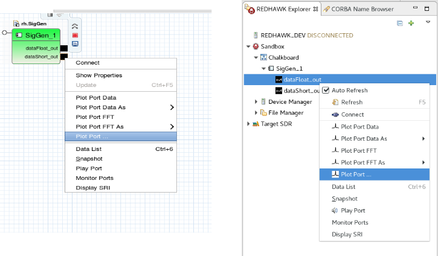
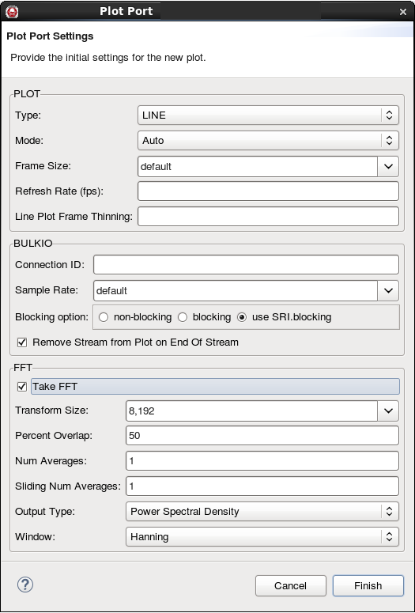

The **Plot Port Wizard** enables users to choose the settings for a plot before opening the **Plot View**. The following procedure explains how to use the **Plot Port Wizard**.

1.  In the REDHAWK Explorer or any running diagram (Chalkboard or Waveform running on a Domain), to open the **Plot Port Wizard**, select an output port, then right-click the selected port and select **Plot Port ...** from the context menu:
    ##### Port Context Menu
    

    The **Plot Port Wizard** is displayed:
    ##### Plot Port Wizard
    

2.  Select a **Type**. The following types are available:

      - DOT
      - LINE
      - POINT
      - RASTER

3.  Select a **Mode**. The following modes are available:

      - Auto
      - Imaginary
      - Magnitude
      - Phase
      - Real
      - Real and Imaginary
      - Real vs Imaginary
      - 10 Log
      - 20 Log

4.  Select a **Frame Size**. This enables you to override the value in StreamSRI, which is the default. You may choose one of the existing values or enter a custom value, for example, 16000.

5.  Optionally, enter a value for **Refresh Rate (fps):**. This enables you to perform smart thinning of the line plot based on screen frames per second. To disable smart thinning, enter 0. The default value of 30 fps will be used if the field is left blank.

6.  Optionally, enter a value for **Line Plot Frame Thinning**. You may thin the line plot by displaying 1 out of every n frames. For no thinning, enter -1. The default value of 8 will be used if the field is left blank.

7.  Optionally, in the **Connection ID** field, enter a custom Connection ID.

8.  To override the value in StreamSRI (the default), in the **Sample Rate** field, enter a custom sample rate.

9.  To select a blocking option for `pushPacket` when the plot is not able to keep up with the data stream, select one of the radio buttons in **Blocking option:**

      - **non-blocking** - Do not block incoming data.
      - **blocking** - Block incoming data.
      - **use SRI.blocking** (default) - Set the blocking based on the `StreamSRI.blocking` field received from the `pushSRI()` call.

10. To remove the stream when an EOS is received, select the **Remove Stream from Plot on End Of Stream** checkbox.

11. To plot an FFT of the signal, select the **Take FFT** checkbox. You have six options for the FFT:

      - Select a **Transform Size** from the list or enter a custom value (Performance is best if the transform size is factorable by 2, 3, 4, and 5).
      - Enter the **Percent Overlap**.
      - Enter the **Num Averages**.
      - Enter the **Sliding Num Averages**.
      - Select the **Output Type**. The following types are available:
          - Normal
          - Magnitude Squared
          - Power Spectral Density

      - Select a **Window**. The following windows are available:

          - Bartlett
          - Hanning
          - Hamming
          - Blackman-Harris
          - Blackman

12. Click **Finish**.

The Plot View is displayed with the desired settings.
