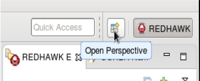
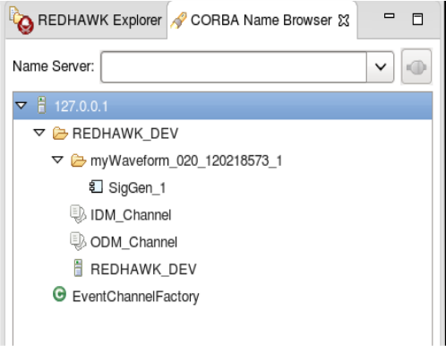

The Eclipse introductory screen displays a **Workbench** button that takes the user to the ide’s development environment: the workbench. The workbench is made up of multiple, smaller windows, which are referred to as views in the Eclipse context.

At the center of the IDE workbench is the editor window, which is empty at initial startup. The editor is the primary window used when developing code within the REDHAWK IDE. An Eclipse editor is a context-sensitive window within the workbench; the language of opened files dictates the type of editor that is opened, impacting editing features such as syntax highlighting.

For a more detailed understanding of the Eclipse environment and nomenclature, consult the online Eclipse documentation at <http://help.eclipse.org/> or the embedded documentation within the REDHAWK IDE by selecting **Help > Search**.

### Perspectives

The views that makeup the workbench, along with the particular layout of those views, are referred to as a perspective. By changing perspectives throughout the development process, a developer may optimize his/her work environment based on the requirements of the particular task at hand. The default perspective in the REDHAWK IDE is the REDHAWK perspective, which is discussed in the following section. A user may switch from the REDHAWK perspective to any other perspective whenever needed.

There are two primary methods for changing perspectives:

  - Click **Open Perspective** from the top right of the workbench.
    ##### Open Perspective
    
  - Select **Window > Open Perspective > Other**.

A view may be resized, moved, and closed within a given perspective to allow for personal customization.

To reset the current perspective to its default state:

  - Click **Window > Reset Perspective…**

### The REDHAWK Perspective

The REDHAWK perspective is comprised of seven views and the editor window. Five of these views are provided by Eclipse IDE, while the remaining two views are REDHAWK-specific.

The following five Eclipse-provided views are in the REDHAWK perspective:

  - Project Explorer View: Provides a hierarchical view of the resources in the Workbench.
  - Outline View: Displays an outline of a structured file that is currently open in the editor area.
  - Properties View: Displays property names and basic properties of a selected resource.
  - Problems View: Automatically logs problems, errors, or warnings when working with various resources in the workbench.
  - [Console View](): Displays a variety of console types depending on the type of development and the current set of user settings.

The following two REDHAWK-specific views are in the REDHAWK perspective:

  - REDHAWK Explorer View: Allows a user to [navigate the contents of a REDHAWK domain](). It provides capabilities for viewing the contents of the domain, configuring instantiated resources, and launching applications in a target SDR environment. It also provides access to the Sandbox, which is an environment for running components and applications without a Domain Manager or a Device Manager.
    ##### REDHAWK Explorer View
    

  - **CORBA Name Browser View**: Maps names to specific CORBA Servants. The **CORBA Name Browser View** is used to examine the current contents of the Naming Service as well as perform basic manipulation of that context. The view displays all currently bound name contexts (folders) and objects. The **CORBA Name Browser View** is displayed in .
    ##### CORBA Name Browser View
    

### Programming Language Specific Perspectives

While the REDHAWK perspective combines views that are commonly used while viewing domain objects, creating REDHAWK resources, and launching applications, many other perspectives are available that are optimized for code development. Because the REDHAWK IDE is built on top of the Eclipse platform, it takes advantage of standard Eclipse, as well as third party, IDE perspectives for the purpose of supporting language-specific development. Specifically, the IDE contains perspectives that support C/C++, Java, and Python development.

For example, the Java perspective combines views that are commonly used while editing Java source files, while the Debug perspective contains the views that are used while debugging Java programs.

For more information on perspectives, particularly the Eclipse default and the programming language-specific perspectives packaged with the REDHAWK IDE, refer to <http://help.eclipse.org/>.
