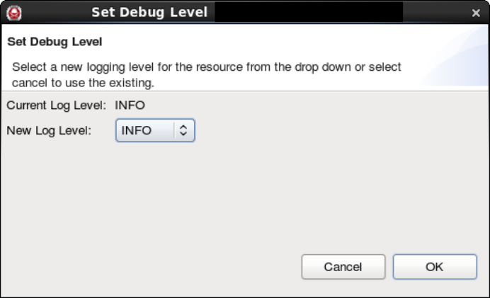

The logging level for the root logger of a component/device can be adjusted at runtime in the IDE. The following procedure explains how to adjust the logging level.

1.  Right-click the running component or device and select **Logging > Log Level**.

    The Set Debug Level dialog displays the current logging level:
    ##### Set Debug Level
    

2.  Select the new logging level you want to use and click **OK**.

    The new log level is used.

After a component or device has been launched, its logging configuration can also be dynamically modified.

1.  Right-click the running component or device and select **Logging > Edit Log Config**. If this is the first time you have used the editor, a warning is displayed.

2.  If a warning is displayed, click **Yes**. The Edit Log Config editor is displayed.

    ##### Edit Log Config
    

    The editor shows the resource’s logging configuration. Saving changes to the editor performs a live update of the resource’s logging configuration.

{}
Changing the logging configuration for a running application instance can affect the Domain Manager process. When changing the logging configuration for an application, restrict the configuration to an application’s logging instance, `Application_impl`; as in the following example.

```bash
log4j.logger.Application_impl=TRACE,applogonly
log4j.appender.applogonly=org.apache.log4j.FileAppender
log4j.appender.applogonly.layout=org.apache.log4j.PatternLayout
log4j.appender.applogonly.layout.ConversionPattern=%d {yyyy-MM-dd HH:mm:ss} %-5p %c:%L - %m%n
log4j.appender.applogonly.File=/tmp/applog.out
log4j.appender.applogonly.Append=true
```
{}
