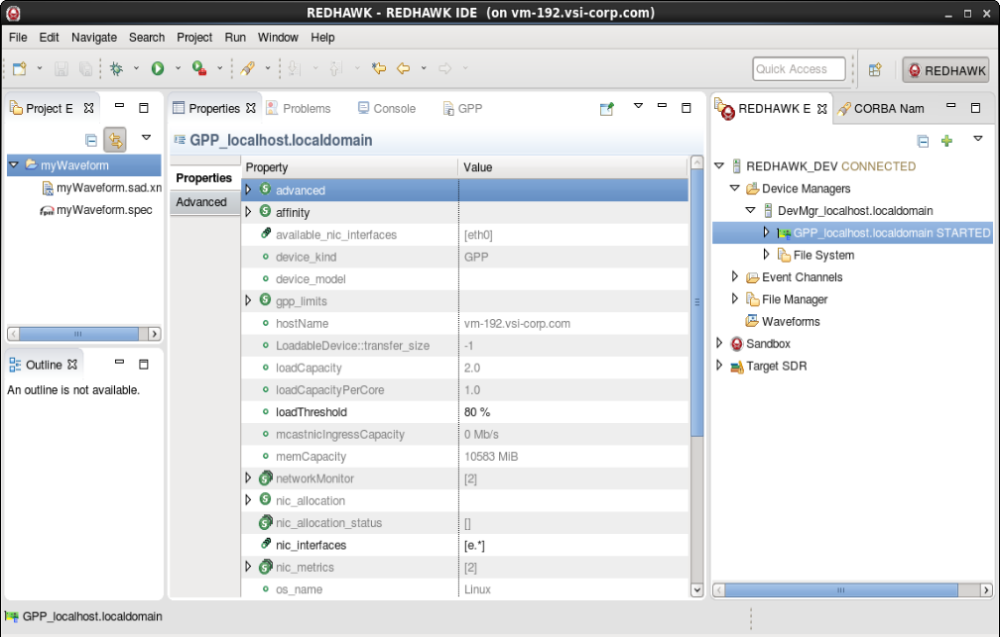
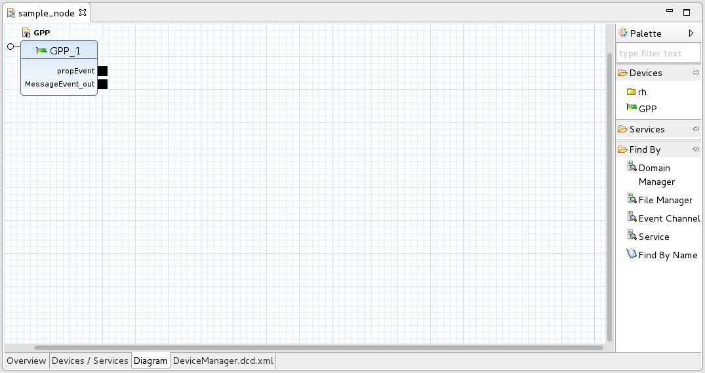

As part of the REDHAWK install, a domain and node are setup by default. To launch the domain and node refer to [Launching a Domain]().

### Exploring the Running Node

1.  In the REDHAWK Explorer View, expand **REDHAWK_DEV**.
2.  Expand **Device Managers**.
3.  Expand **DevMgr_\<localhost\>.localdomain**.
4.  Select **GPP_\<localhost\>_localdomain**.
5.  Select the **Properties** view tab. The **Properties** view displays all the properties for this device, such as the operation system name, amount of available memory, and other important information, as seen below:

##### Properties View of a Running GPP

### Creating a Component that Consumes Resources

All components consume processor resources such as memory and CPU capacity. These resources are automatically tracked by the GPP, and when its thresholds are exceeded, the GPP enters the BUSY state, preventing further [deployments onto the computer](). However, in some cases, it is desirable for the component to consume some other capacity on the computer that is not part of the standard REDHAWK deployment model. The GPP contains several `allocation` properties such as `mcastnicIngressCapacity` or `mcastnicVLANs` that are available as a deployment constraint but are not used by the default component builds.

In a more generalized way, when a device's specialized capacity is added to the device as a property of kind `allocation`, components can be created that will allocate this attribute of the device, making this `allocation` property a deployment constraint for the component.

{}
Extending the GPP with new properties requires a modification of the GPP's source code and risks compatibility with other developers' components.
{}

To create a component that consumes these kind of `allocation` resources:

1.  Create a Python component called `sample`.
2.  In the Project View, select the **Implementations** tab.
3.  On the bottom-right of this view, the **Dependencies** section is visible. Click **Add...** on the **Dependency** subsection of the **Dependencies** section.
4.  In the **Dependency Wizard**, select **Kind=Property Reference** and **Type=allocation**.
5.  The `Refid` field is more complicated; the component needs to be given some property that the component consumes when it is running on a device. An example of such a property is memory. For this example, memory is an attribute (property) of the device that the component consumes. To describe this, click the **Browse** button on the **Refid** field and select **GPP:memCapacity** (do not worry if there are multiple instances of the same property on the list, just pick one).
6.  After selecting this property, the globally unique ID of the property populates the **Refid** field, which in this case is: **DCE:8dcef419-b440-4bcf-b893-cab79b6024fb** (this is the `id` of the corresponding property of the gpp). To complete the dependency definition, provide a value for the consumption of this property: in this case, set **Value=***1000*.
7.  Click **Finish**.
8.  Save the project, generate the code and drag the component project to **REDHAWK Explorer > Target SDR**.

### Create a Waveform for the New Component

1.  Create a new waveform called `sample_deploy`.
2.  Drag the component `sample` from the Palette onto the Diagram.
3.  Save the project and drag the project *sample_deploy* from the **Project Explorer** to **REDHAWK Explorer > Target SDR**.

### Observe the Effect of Launching the Component

1.  On the running domain, select **GPP_\<localhost\>_localdomain** and note the value for **memCapacity** on the [**Properties** tab for the GPP device](#properties-view-of-a-running-gpp).
2.  Launch the application *sample_deploy* on the running domain (right-click domain, select **Launch Waveform... \> sample\_deploy > Finish**). Note **memCapacity** for **GPP_\<localhost\>_localdomain** again; it is 1000 less than before the launch of the application.
3.  Release the application (**REDHAWK_DEV > Waveforms > sample\_deploy\_\<\#\>** right-click **Release**). Note memCapacity for **GPP_\<localhost\>_localdomain** again; it is restored to the original value.

### Creating a New Node

As shown in [Exploring the Running Node](#exploring-the-running-node) a node is a Device Manager instance with an associated set of devices and services. A node is completely defined by a DMD XML file. A Device Manager uses the information in this XML file to deploy, configure, and inter-connect devices and [services]().

The **REDHAWK Node Project** in the REDHAWK IDE provides a mechanism for generating these DMD files. By invoking the **REDHAWK Node Project**, a wizard is started where the developer selects different characteristics for the node like the project name. In the wizard, the developer must provide both a project name and a Domain Manager name. The Domain Manager name is the name of the domain that the Device Manager automatically associates with upon startup. At runtime, the Domain Manager name that the Device Manager associates with can be overridden.

The node project has multiple tabs. The most intuitive tab is the Diagram tab, which allows a developer to drag devices available in `$SDRROOT` into the node, as shown below.  Once the set of members for a particular node is determined, save the project and drag it to **Target SDR** to install it.

##### Node Design Diagram

To launch this new node:

1.  Right-click the node descriptor, **Target SDR  > nodes > sample_node**.
2.  Select **Launch Device Manager**. The running node is now visible under the running domain’s **Device Managers** section.
