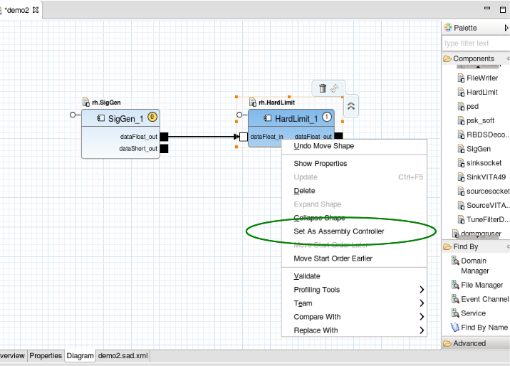
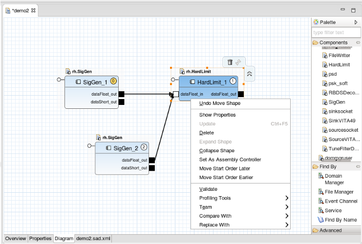
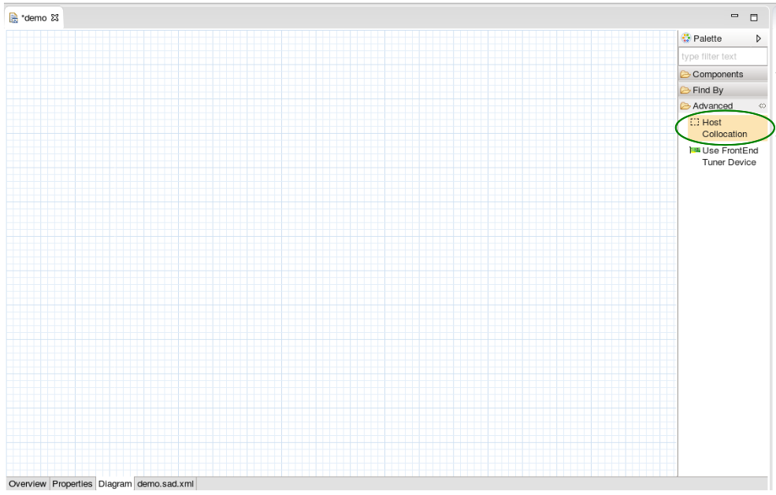
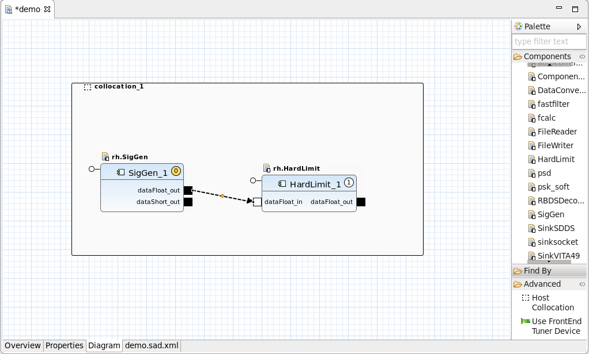
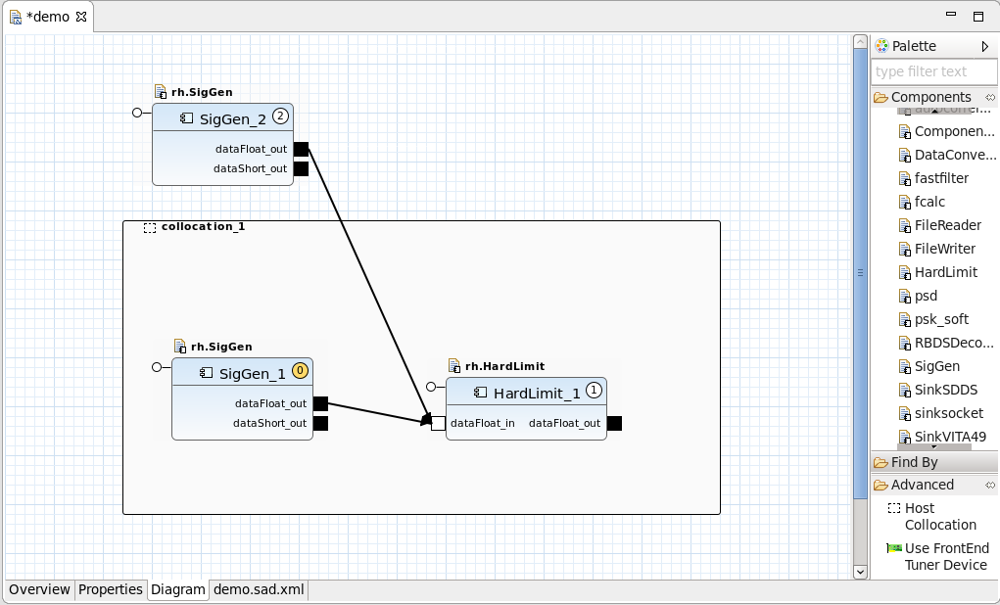
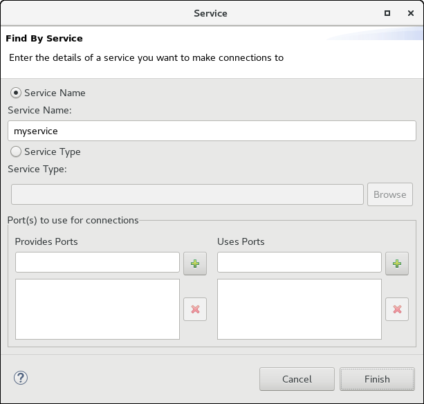

Applications are software objects representing waveforms. They are used to organize a group of components that are linked together to accomplish a useful computational task. Applications provide a convenient way to move data around in order to achieve these different tasks by allowing for components to easily be interchanged.

### Application Class

Each application contains a unique application name and profile, which describes the application’s configuration. This profile is a SAD file that is referenced by a File Manager.

An `Application` object is responsible for providing control, configuration, and status of any application that is instantiated in the domain. In order to accomplish this, each `Application` object maintains various data structures to monitor all aspects of its execution.

A list of SPD implementation IDs and a list of pids are kept for each component that makes up the application in order to manage their life cycles. Since every component has to be associated with at least one device, each component is also stored in a list with the device that it uses, is loaded on or is executed on.

Upon completion, the `Application`’s `releaseObject()` function is responsible for various clean up tasks. Any task or process allocated on Executable devices are stopped using the `terminate()` function. All memory allocated by component instances on Loadable devices is freed using the `unload()` function. Finally, any additional capacities or resources that were allocated during creation are released using the device’s `deallocateCapacity()` method. These changes return the devices to the state they were in before the application was launched (the state of the devices may not have changed during application execution).

All object references to components that make up the application are released and all connected ports are disconnected. Any consumers or producers that were connected to a CORBA Event Channel are removed. Finally, all component’s naming contexts are unbound from the Naming Service.

### SAD File

The SAD File is where information about a waveform’s composition and configuration is stored. It is an XML file that contains tags for all of the elements required for the application to be built and is located in: `$SDRROOT/dom/waveforms/WAVE_NAME`. This file is parsed by the runtime environment and used by an ApplicationFactory to construct the desired waveform.

Individual elements of the file include:

  - References to all required component’s SPD and their locations
  - Required connections between the component’s ports and interfaces
  - External ports
  - Required connections to devices
  - Name given in Naming Service
  - Co-Location (deployment) dependencies
  - Assembly Controller
  - Start order of the components

Within the SAD file, each component instantiation has a unique ID,  which allows support for multiple instantiations of the same component. In this situation, each component would have the same file reference, a unique ID, as well as a unique name in the Naming Service that is based off of the component’s usage name. For multiple instantiations of the same component, the trailing digit on the usage name is simply incremented.

### Assembly Controller and Start Order

Each waveform has only one Assembly Controller that serves as the starting point for the application. The component that is marked as the Assembly Controller is responsible for delegating implementations of the inherited CF::Resource functions that include:

  - `start()`
  - `stop()`
  - `configure()`
  - `query()`

By default, the first component added to a waveform is the Assembly Controller. However, the Assembly Controller can be changed to any component in the waveform by right-clicking on the component in the waveform diagram and selecting **Set As Assembly Controller** from the context menu.

##### Assembly Controller Assignment


In the waveform diagram, the circled number in the component indicates the component’s designated start order. This is the order that the `start()` function is called on the components within the waveform.

{}
The Assembly Controller is always started first.
{}

To modify the start order:

1.  In the waveform diagram, right-click the component for which you want to change the start order.
2.  Select **Move Start Order Earlier** to start the component earlier.
3.  Select **Move Start Order Later** to start the component later.

    ##### Start Order Assignment
    

### Host Collocation

To address varying performance considerations, some application designs may require multiple components be deployed on the same piece of hardware. To meet this type of requirement, in the `sad.xml` file, you can specify that a set of components be collocated on a single host at runtime.

To collocate components in the IDE:

1.  Open the **Advanced** section of the Palette.
2.  Select **Host Collocation**.
    ##### Select Host Collocation  
    
3.  Drag **Host Collocation** onto the Diagram.
    The collocation area is displayed.
    ##### Collocation
    
4.  Add desired components to the collocated area.
    ##### Add Components to Host Collocation
    
5.  Finalize other component connections.
    ##### Finalize Other Component Connections
    

### External Ports

Within the REDHAWK Framework, a particular component’s port can be designated as an external port so that it is accessible to external waveform objects. Using external ports, a complex waveform may be subdivided into smaller more manageable waveforms. Marking a port as external adds an `external` ports tag in the SAD XML file containing the component instance that owns the port in question. Additionally, the color of the port’s block in the diagram changes color to mark it as externally accessible. For information about marking a Port as external, refer to [Waveform Editor Diagram Tab]().

External ports can be renamed in the Overview tab of the application’s SAD file. Renaming a port enables other applications to access the port with a different name instance than the one specified in the components SCD file, thus preventing naming collision. For information about renaming an external port, refer to [Waveform Editor Overview Tab]()).

### External Properties

Individual component properties can be promoted as external in the properties tab of the application’s SAD file, which enables other applications to access these internal property values through `configure()` and `query()`. To prevent naming collision, the property ID can also be assigned an external id. If no external ID is specified, the internal property ID from the components PRF file is used as its external id. For information about making a property external, refer to [Waveform Editor Properties Tab]()).

### Using the Find By Feature

A Find By represents an object within a REDHAWK domain that will be available at runtime (when the waveform is launched in a domain). Find Bys contain details that describe the object. For example, the details may specify that it is a domain manager or it is a Service with a specific name. When a waveform is launched in a domain, the Find By details help to locate the appropriate object, and then any connections the user specified in the waveform are established. Those connections are sometimes directly to the object itself, or sometimes to ports on the object, depending on the context. You can search for a resource by name, a service by name or type, or an Event Channel by name.

#### Find By Name

To find a resource in the domain by name:

1.  From the **Palette**, in the **Find By** folder, select **Find By Name** and drag it onto the diagram.  The **Find By Name** dialog is displayed.
##### Find By Name
    
2.  Enter the name of the component you want to find.
3.  Optionally, enter the component’s ports names that you want to use. For Provides ports, enter the name and click **Add Provides Port**. For Uses ports, enter the name and click **Add Uses Port**.
4.  Click **Finish**.

    The **Find By Name** is displayed in the diagram.

#### Find By Service

To find a service in the domain:

1.  From the **Palette**, in the **Find By** folder, select **Service** and drag it onto the diagram. The **Find By Service** dialog is displayed.
##### Find By Service

2.  If you want to search for a service Name, select the **Service Name** radio button and enter the service Name you want to find.
3.  If you want to search for a service Type, select the **Service Type** radio button and enter the service Type you want to find. The service Type indicates the interface (IDL) provided by the service. Click **Browse** to select an IDL type the IDE recognizes.
4.  Optionally, enter the component’s ports names that you want to use. For Provides ports, enter the name and click **Add Provides Port**. For Uses ports, enter the name and click **Add Uses Port**.
5.  Click **Finish**.

    The **Service Name** or **Service Type** is displayed in the diagram.

#### Find By Event Channel

To find an event channel in the domain:

1.  From the **Palette**, in the **Find By** folder, select **Event Channel** and drag it onto the diagram.

    The **Event Channel** dialog is displayed.
    ##### Event Channel
    
2.  Enter the name of the Event Channel you want to find and click **OK**.

    The **Event Channel** is displayed in the diagram.

###  *usesdevice* Relationship

An application may require that specific devices are running in order for the application to be deployed. The *usesdevice* relationship is a mechanism for expressing such a requirement. The *usesdevice* relationship also enables the application to connect ports of components within the SAD file to ports of devices running in a node. These specifications are handled through tags in the application’s SAD XML, which can contain any number of *usesdevice* relationships. Each *usesdevice* relationship has a unique ID with a set of [allocation property]() dependencies required for the relationship to be satisfied..

The following example XML expresses the *usesdevice* relationship and must reside within the `softwareassembly` element of the SAD XML file. The `usesdevicedependencies` element must be the last element within the `softwareassembly` element.

```xml
<usesdevicedependencies>
    <usesdevice id="uses_device_1">
      <propertyref refid="os" value="linux"/>
    </usesdevice>
    <usesdevice id="uses_device_2">
      <structref refid="struct_alloc_prop">
        <simpleref refid="long_capacity" value="10"/>
        <simpleref refid="float_capacity" value="0.1"/>
      </structref>
    </usesdevice>
</usesdevicedependencies>
```

In the above example, there are two *usesdevice* dependencies with IDs of `uses_device_1` and `uses_device_2`. The first requires a property with an ID of `os` that matches the value of `linux`. The second requires a `struct` with an ID of `struct_alloc_prop` with members `long_capacity` and `float_capacity` that have the necessary available capacity specified in the `value` tag.

Once these dependencies have been declared, port connections can be made in the connections section of the SAD XML file. The following example makes two connections. The first connection is from the port: `output_port` of `Component_1` to the port: `input_port` of the device that satisfies the `uses_device_1` relationship. The second is from the port: `output_port` of the device that satisfies the `uses_device_2` relationship to the port: `input_port` of `Component_2`.

```xml
<connections>
  <connectinterface id="connection_1">
    <usesport>
      <usesidentifier>output_port</usesidentifier>
      <componentinstantiationref refid="Component_1"/>
    </usesport>
    <providesport>
      <providesidentifier>input_port</providesidentifier>
      <deviceusedbyapplication usesrefid="uses_device_1"/>
    </providesport>
  </connectinterface>
  <connectinterface id="connection_2">
    <usesport>
      <usesidentifier>output_port</usesidentifier>
      <deviceusedbyapplication usesrefid="uses_device_2"/>
    </usesport>
    <providesport>
      <providesidentifier>input_port</providesidentifier>
      <componentinstantiationref refid="Component_2"/>
    </providesport>
  </connectinterface>
</connections>
```
