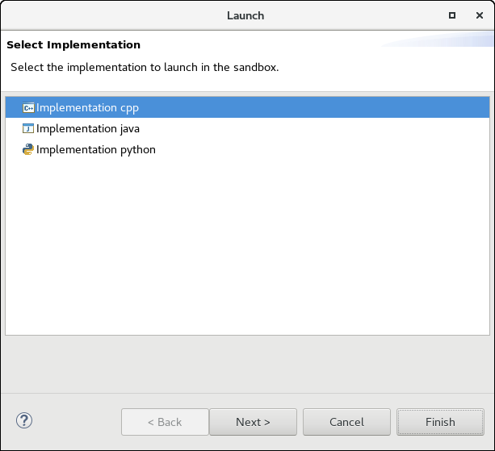
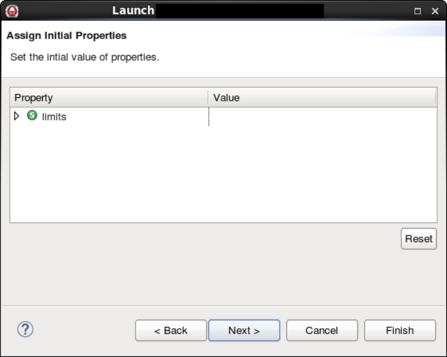
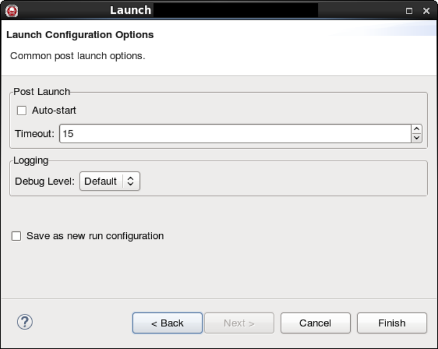
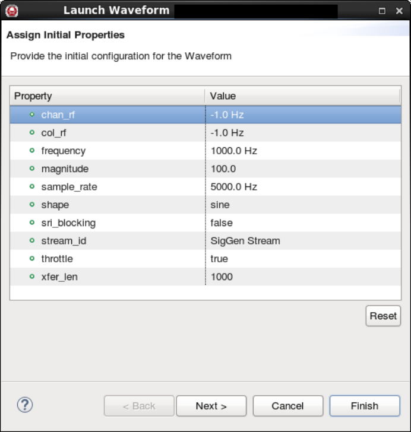
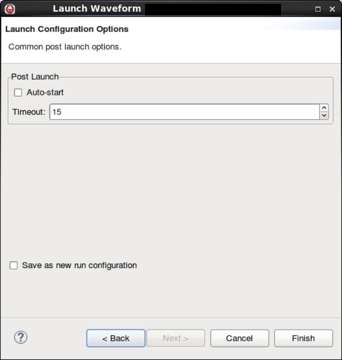

The IDE-based Sandbox provides a graphical environment for launching, inspecting, and debugging components, devices, services, and waveforms. The IDE-based Sandbox can host an instance of a [Python-based Sandbox](), with both interlinked, allowing artifacts from the Python environment to interact with those on the graphical UI.

### Launching Components in the IDE Sandbox

The following procedures explain how to launch a component in the IDE Sandbox.

#### Default Property Values

1.  To launch an implementation of a component with default property values, from the REDHAWK Explorer View, right-click the component, select **Launch in Sandbox**, and select an implementation of the component to start within the Sandbox’s Chalkboard.

    The component is launched in the Sandbox. The component will initially be gray in color until launching is complete. When the component is finished loading, its background color is blue.

#### Customized Property Values

1.  To launch an implementation of a component with customized property values, from the REDHAWK Explorer View, right-click the component, select **Launch in Sandbox**, and select **Advanced**.

    If the component has multiple implementations, the Select Implementation dialog of the Launch wizard is displayed. Select the implementation and click Next.

    

    The Assign Initial Properties dialog of the Launch wizard is displayed.

    

2.  Enter the Properties information and click Next.

    The Launch Configuration Options dialog is displayed.

    

3.  Specify the launch options and click Finish.

    The component is launched in the IDE Sandbox. The component will initially be gray in color until launching is complete. When the component is finished loading, its background color is blue.

### Launching Devices in the IDE Sandbox

The following procedures explain how to launch a device in the IDE Sandbox.

#### Default Property Values

1.  To launch an implementation of a device with default property values, from the REDHAWK Explorer View, right-click the device, select **Launch in Sandbox**, and select an implementation of the device to start within the Sandbox’s Chalkboard.

    The device is launched in the Sandbox.

#### Customized Property Values

1.  To launch an implementation of a device with customized property values, from the REDHAWK Explorer View, right-click the device, select **Launch in Sandbox**, and select **Advanced**.

    If the device has multiple implementations, the Select Implementation dialog of the Launch wizard is displayed. Select the implementation and click Next.

    The Assign Initial Properties dialog of the Launch wizard is displayed.

2.  Enter the Properties information and click Next.

    The Launch Configuration Options dialog is displayed.

3.  Specify the launch options and click Finish.

    The device is launched in the IDE Sandbox.

### Launching Services in the IDE Sandbox

The following procedures explain how to launch a service in the IDE Sandbox.

#### Default Property Values

1.  To launch an implementation of a service with default property values, from the REDHAWK Explorer View, right-click the service, select **Launch in Sandbox**, and select an implementation of the service to start within the Sandbox’s Chalkboard.

    The service is launched in the Sandbox.

#### Customized Property Values

1.  To launch an implementation of a service with customized property values, right-click the service, select **Launch in Sandbox**, and select **Advanced**.

    If the service has multiple implementations, the Select Implementation dialog of the Launch wizard is displayed. Select the implementation and click Next.

    The Assign Initial Properties dialog of the Launch wizard is displayed.

2.  Enter the Properties information and click Next.

    The Launch Configuration Options dialog is displayed.

3.  Specify the launch options and click Finish.

    The service is launched in the IDE Sandbox.

### Launching Waveforms in the IDE Sandbox

The following procedures explain how to launch a waveform in the IDE Sandbox.

#### Default Property Values

1.  To launch a waveform with default property values, right-click the waveform, select **Launch in Sandbox**, and select Default.

    The waveform is launched in the Sandbox.

#### Customized Property Values

1.  To launch a waveform with customized property values, right-click the waveform, select **Launch in Sandbox**, and select **Advanced**.

    The Assign Initial Properties dialog of the Launch waveform wizard is displayed.

    

2.  Enter the Properties information and click Next.

    The Launch Configuration Options dialog of the Launch waveform wizard is displayed.

    

3.  Specify the launch options and click Finish.

    The waveform is launched in the IDE Sandbox.
