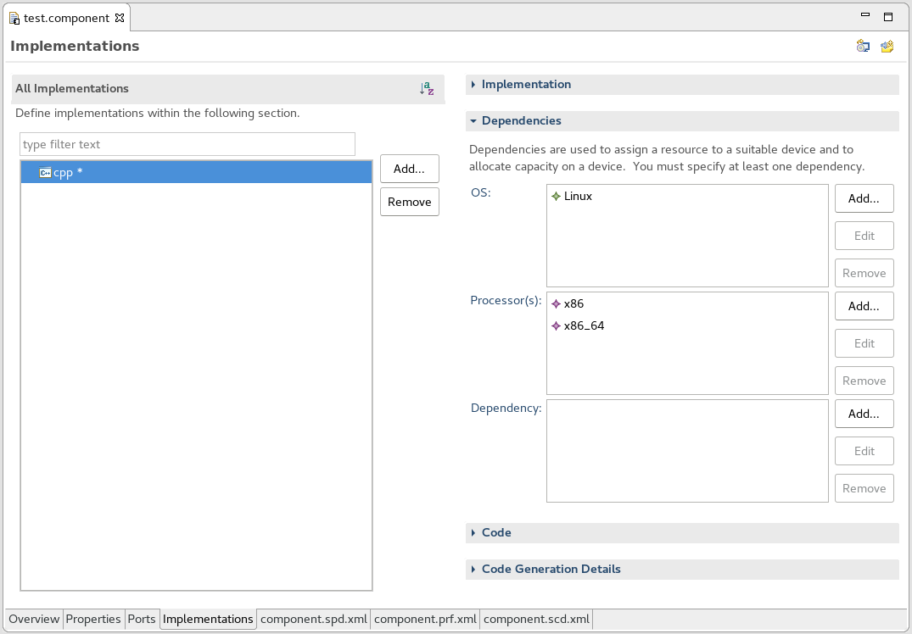
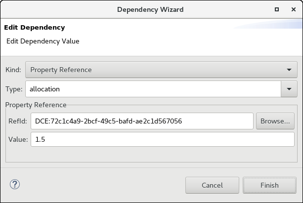
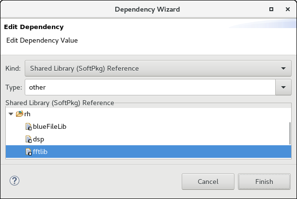
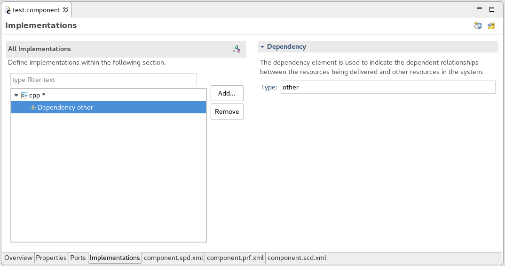

To add a shared library dependency to a component or device:

{}
The shared library must be installed to `SDRROOT` before you can add it to a component or device.
{}

1.  Open the SPD file for the component or device.
    #####  Component SPD File
    

2.  Select the **Implementations** tab.
    ##### Component Implementations Tab
    

3.  On the left side of the editor, select the appropriate implementation.

4.  On the right side of the editor, under **Dependencies**, next to the **Dependency** box, click **Add...**

    The Edit Dependency dialog is displayed.
    ##### Edit Dependency Dialog
    

5.  In the dialog, change the **Kind** to **Shared Library (SoftPkg) Reference**.

6.  In the **Type** box, select **other**.

7.  Select a shared library from the list of shared libraries installed in the `SDRROOT`.
    ##### Shared Library Dependency Dialog
    

8.  Click **Finish**.

    The shared library dependency is displayed under the All Implementations section of the Implementations tab.
    ##### Shared Library Project Dependency
    

9.  To update your code to use the dependency, click the **Generate All Implementations** icon.
