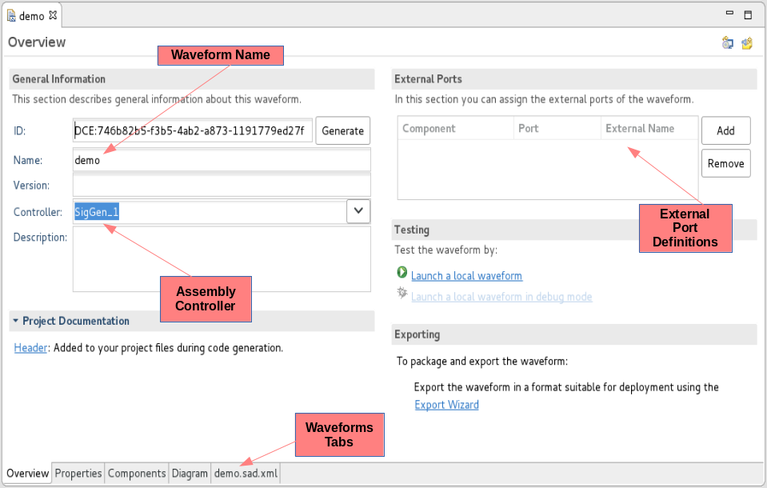

The following sections further describe the definition of the waveform as well as its creation and manipulation within the IDE. Like the PRF, SCD, and SPD XML files of a component, a waveform is completely represented by its SAD file (`*.sad.xml`). The REDHAWK IDE provides a means of modifying the XML files without the need to directly edit this file by hand.

### Overview Tab

Within the Overview tab, the name, Assembly Controller, and external ports of a waveform are defined.

The Assembly Controller is a component instance in the waveform that is designated as the component where the waveform-level `start()`, `stop()`, `configure()`, and `query()` calls are delegated. In complex waveforms, the Assembly Controller can be used to orchestrate the life cycle of components. In trivial waveforms, the identity of the Assembly Controller is of less importance.

External ports are used to make component ports available to other applications, facilitating inter-application connectivity.

Developers use the Overview tab to set the Assembly Controller for the waveform and describe the waveform.

The following steps explain how to set the Assembly Controller and describe the waveform.

1.  On the Overview tab of the Waveform, from the **Controller** drop-down menu, ensure `SigGen_1` is selected.
2.  In the **Description** field, enter a description for the waveform.

##### Waveform Overview Tab

### Diagram Tab

Most of the work done on waveforms takes place within the Diagram tab. The Diagram tab is very similar to the Sandbox/Chalkboard. Unlike the Sandbox, only components that exist within the `$SDRROOT` can be added to the waveform. The Palette contains a list of components residing within the `$SDRROOT`. From the Diagram tab, external ports of the waveform can be indicated and the role of Assembly Controller can be assigned to a component.

From the Diagram tab, properties of components can be set. When these properties are set, they become specific to the waveform and are written to the `*.sad.xml` file, which describes this waveform.

#### Start Order

Each of the components within the waveform contain a number with a circle around it which represents that component’s start order. The start order represents the order in which its `start()` method is called by the Assembly Controller. The only component that does not have a start order is the Assembly Controller, which always has an assumed start order of 0. The Assembly Controller has a yellow circle containing 0. The start order may be changed by right-clicking a component and selecting **Move Start Order Earlier** or **Move Start Order Later** from the context menu. The Assembly Controller may be changed by right-clicking a component and selecting **Set As Assembly Controller** from the context menu.

### SAD File Tab

The information put into the Overview and Diagram tabs is represented within the XML of the SAD file. The XML can be edited manually, but it is not recommended. Each of the components used within the waveform are referenced within the SAD file by pointing to the file location of the component’s SPD file.

Instructions for inspecting the SAD file are below:

1.  Open the `myWaveform.sad.xml` tab of the waveform Editor.
2.  Look through the SAD file and identify:
    -  The location of the two SPD files used in this waveform (remember that this file location is in reference to the `$SDRROOT`)
    -  The Assembly Controller
    -  The connection between the two components
    -  The external port is set in the Diagram Tab
    -  The start order of each component
    -  The property is changed on the `SigGen` component
3.  Before continuing, return to the Diagram tab and change the **dataDouble_out** port so that it is no longer marked as an external port.
